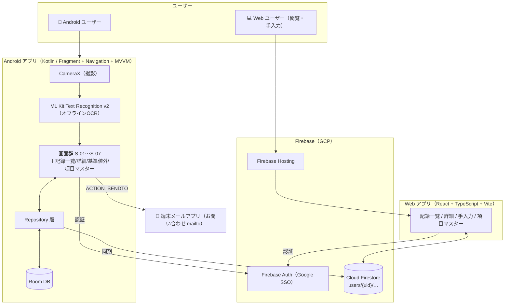

# health-checkup-manager

An Android app for managing health checkup results with OCR scanning, trend graphs, and abnormal value alerts.

## Features

- **OCR Scanning**: Capture health checkup result sheets via camera (ML Kit, offline)
- **Manual Input**: Fallback for OCR failures or corrections
- **Dynamic Items**: Flexible schema to support varying test items across medical facilities
- **Trend Graphs**: Year-over-year comparison charts (MPAndroidChart)
- **Alerts**: Notifications for out-of-range values (data display only, no medical advice)
- **Google SSO**: Firebase Authentication

## Tech Stack

| Layer | Technology |
|-------|-----------|
| Platform | Android (Kotlin, min API 26) |
| Camera | CameraX |
| OCR | ML Kit Text Recognition v2 |
| Local DB | Room |
| Graph | MPAndroidChart |
| Auth | Firebase Auth (Google SSO) |

## Getting Started

1. **Clone the repository:**
   ```bash
   git clone https://github.com/your-username/health-checkup-manager.git
   cd health-checkup-manager/android
   ```

2. **Set up Firebase:**
   - Create a new Firebase project at [https://console.firebase.google.com/](https://console.firebase.google.com/).
   - Add an Android app to your Firebase project with the package name `com.example.healthcheckupmanager`.
   - Download the `google-services.json` file and place it in the `android/app/` directory.
   - Enable Google Sign-In in the Firebase console under **Authentication > Sign-in method**.

3. **Build and run the app:**
   - Open the `android` directory in Android Studio.
   - Let Gradle sync and download the required dependencies.
   - Run the app on an emulator or a physical device.

## アーキテクチャ / 構成図



詳細は [docs/architecture.md](docs/architecture.md) を参照。

## Project Structure

```
health-checkup-manager/
├── android/        # Android application (Kotlin)
├── web/            # Web application (React + TypeScript + Vite)
├── specs/          # Feature specs (spec-driven development)
├── docs/           # Design documents and backlog
└── DESIGN.md       # UI design tokens & rules
```

## Development

See [docs/](docs/) for architecture design and backlog, and [specs/001-screen-flow-renewal/](specs/001-screen-flow-renewal/) for the ongoing screen-flow renewal.

## Testing

### Web CI (type check, lint & build)

`web/` is validated in CI by [`.github/workflows/web-ci.yml`](.github/workflows/web-ci.yml) on every push to `main` and every pull request. It installs dependencies, then runs lint and the production build (which includes the TypeScript type check via `tsc -b`).

To run the same checks locally:

```bash
npm ci --prefix web
npm --prefix web run lint
npm --prefix web run build
```

### Firestore rules unit tests

`firestore.rules` is covered by unit tests (`firestore-tests/rules.test.mjs`) that run against the Firebase Emulator. These are enforced in CI by [`.github/workflows/firestore-rules-test.yml`](.github/workflows/firestore-rules-test.yml) on any push/PR touching `firestore.rules` or `firestore-tests/**`.

To run them locally:

```bash
npm ci --prefix firestore-tests
npm --prefix firestore-tests run test:emulator
```

This spins up the Firestore Emulator with a dummy project ID (no Firebase credentials required) and executes all rules tests against it.

## Compliance

This app displays health data only. It does not provide medical diagnosis, treatment advice, or improvement suggestions, in compliance with Japanese pharmaceutical and medical device regulations.
