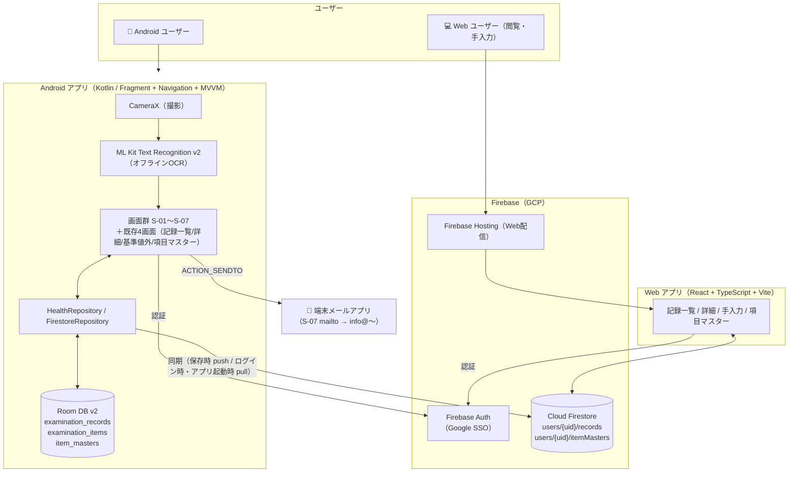

# 健康診断結果ツール 技術選定・アーキテクチャ設計

> **作成日:** 2026-04-03  
> **担当:** po_agent  
> **関連タスク:** https://www.notion.so/3331787eeeae8025bc30e9028a379f12

---

## 1. アーキテクチャ概要

```
[Android アプリ]                        [Web アプリ]
    │                                       │
    ├── CameraX（撮影）                     ├── 手動入力フォーム
    │       ↓                               │
    ├── ML Kit OCR                          ├── 記録一覧・詳細閲覧
    │       ↓                               │
    ├── OCR結果確認・手動補正UI             ├── 経年グラフ（Chart.js）
    │       ↓                               │
    ├── Room DB（オフラインキャッシュ）      └── Firebase Auth（Google SSO）
    │       ↕ 同期                                  │
    ├── Firestore SDK ─────────────────── Cloud Firestore（共有DB）
    │                                               │
    ├── MPAndroidChart（グラフ表示）        Firebase Hosting
    │
    └── Firebase Auth（Google SSO）
```

### データ同期方針

- **Cloud Firestore** を単一の真実の源（Single Source of Truth）とする
- **Android**: Room をオフラインキャッシュとして保持し、Firestore と双方向同期
  - push（Room→Firestore）: 記録保存時（`saveRecord`）・項目マスター更新時（`upsertMaster`）に都度実行
  - pull（Firestore→Room）: 次の2箇所から `HealthRepository.restoreFromFirestore(uid)` を呼び出す
    - サインイン成功直後（`LoginViewModel.signIn()`）: 初回ログイン時、他端末のデータを取り込む
    - アプリ起動時（`MainActivity.onCreate()` → `HealthRepository.resyncOnStartupIfNeeded()`、Issue #26）:
      既にログイン済みのユーザーがアプリを再起動した場合、Web側で追加・編集された記録を反映する。
      `lifecycleScope` 上のバックグラウンドコルーチンから呼び出し、UIをブロックしない。
      未ログイン時は何もせず、`HealthRepository` インスタンスあたり（＝1起動あたり）実際の同期は1回のみに制限する（多重実行防止）。
      Firestore例外・オフライン時は無視し、既存のローカルデータをそのまま使用する。
      なお `restoreFromFirestore` は upsert のみで、Firestore側に存在しない記録をRoomから削除しない
      （Web側で削除した記録の反映は本Issueのスコープ外・別Issueで対応）。
- **Web**: Firestore を直接参照（ローカルキャッシュ不要、MVP段階）
- **認証**: 両プラットフォームとも Firebase Auth（同一プロジェクト）でユーザーIDを共有
- **データ分離**: Firestoreのパス `users/{uid}/records/{recordId}` でユーザーごとに分離

### フェーズ分割

| フェーズ | 内容 | 目標時期 |
|---------|------|---------|
| Phase 1 (完了) | Android: カメラOCR→手動補正→Room保存→グラフ・通知 | 4/4 完了 |
| Phase 2 (完了) | Android: Firebase Auth Google SSO・UIブラッシュアップ | 4/4 完了 |
| Phase 3 (完了) | Android: Firestore同期追加（Room→Firestoreへの書き込み） | 完了 |
| Phase 4 (完了) | Web: Firebase Hosting + React + Firestore（手動入力・閲覧） | 完了 |
| Phase 5 | Android: 画面遷移・画面仕様刷新（S-01〜S-07。`specs/001-screen-flow-renewal/`） | 2026-07 進行中 |

### 環境構成図（2026-07-18 更新）



---

## 2. 技術選定

### 2-1. OCR

**選定: ML Kit Text Recognition v2**

| 比較項目 | ML Kit v2 | Google Vision API |
|---------|-----------|-------------------|
| オフライン | ✅ 可能 | ❌ 要通信 |
| コスト | 無料 | 従量課金 |
| 精度 | 高（日本語対応） | 最高精度 |
| 実装コスト | 低 | 中（APIキー管理必要） |

**採用理由:** オフライン動作・無料・日本語精度が十分。精度不足が判明した場合はVision APIへ切り替え可能な設計にする。

### 2-2. カメラ

**選定: CameraX**

- Jetpack公式ライブラリ、複数枚撮影対応
- ImageAnalysis APIでリアルタイムOCRプレビューも可能
- ライフサイクル管理が容易

### 2-3. ローカルDB / クラウドDB

**Android: Room（オフラインキャッシュ） + Cloud Firestore（クラウド同期）**

- Room は既存実装を維持しオフライン対応を担保
- Firestore SDK を追加し、保存時に Room と Firestore の両方へ書き込む
- Repositoryパターン済みのため、Firestoreの追加は Repository 層のみ修正で対応可能

**Web: Cloud Firestore（直接参照）**

- Room不要。Firestoreをリアルタイムリスナーで参照
- オフライン対応はFirestore SDKの組み込みキャッシュに委ねる（MVP段階）

### 2-4. グラフ

**選定: MPAndroidChart**

- Android向けグラフライブラリとして最も実績豊富
- 折れ線グラフ・バーグラフ対応
- Vico（Compose向け）も検討したが、安定性でMPAndroidChartを優先

### 2-5. 認証

**選定: Firebase Authentication（Google SSO）**

- Android・Web 両プラットフォームで同一Firebase プロジェクトを使用
- 同一ユーザーIDにより Firestore 上でデータを共有
- フォールバック: メール＋パスワード認証

### 2-6. Webフロントエンド

**選定: React + TypeScript + Vite**

| 比較項目 | React | Next.js | Vue |
|---------|-------|---------|-----|
| Firebase連携 | ✅ 容易 | ✅ 容易 | ✅ 容易 |
| 学習コスト | 低〜中 | 中 | 低〜中 |
| SSR必要性 | ❌ 不要（認証後のSPA） | 過剰 | — |
| ホスティング | Firebase Hosting（SPA） | — | — |

**採用理由:** 認証後のSPAのため、SSRは不要。ViteによるシンプルなReact + TypeScript構成でFirebase Hostingに静的デプロイ。

### 2-7. Webホスティング

**選定: Firebase Hosting**

- Firebase Auth / Firestore と同一プロジェクトで管理
- CLIデプロイ（`firebase deploy`）で簡易運用
- カスタムドメイン対応

---

## 3. データモデル設計

### 動的項目への対応方針

医療機関により検査項目が異なるため、固定スキーマではなくKey-Value型で管理する。

```
ExaminationRecord（診断記録）
├── id: Long (PK)
├── date: LocalDate（受診日）
├── facility: String（医療機関名、任意）
├── createdAt: Instant
└── [1:N] → ExaminationItem

ExaminationItem（検査項目）
├── id: Long (PK)
├── recordId: Long (FK)
├── itemName: String（項目名 例: "血圧(収縮期)"）
├── value: String（値 例: "120"）
├── unit: String（単位 例: "mmHg"）
├── referenceMin: Double?（基準値下限）
├── referenceMax: Double?（基準値上限）
└── isAbnormal: Boolean（基準値外フラグ）

ItemMaster（項目マスター）
├── itemName: String (PK)
├── unit: String
├── referenceMin: Double?
├── referenceMax: Double?
├── category: String（カテゴリ。2026-07-18 刷新001で追加）
├── isFavorite: Boolean（お気に入り。同上）
└── favoritedAt: Long?（お気に入り登録日時＝並び順。同上）
```

> Room スキーマ v2 への Migration とマスタシード定義は `specs/001-screen-flow-renewal/data-model.md` を参照。

### Firestoreデータモデル

```
users/{uid}/
  ├── records/{recordId}/
  │     ├── date: Timestamp
  │     ├── facility: String
  │     ├── createdAt: Timestamp
  │     └── items: Array<Map>
  │           ├── itemName: String
  │           ├── value: String
  │           ├── unit: String
  │           ├── referenceMin: Number?
  │           ├── referenceMax: Number?
  │           └── isAbnormal: Boolean
  └── itemMasters/{itemName}/
        ├── unit: String
        ├── referenceMin: Number?
        ├── referenceMax: Number?
        ├── category: String?（欠損時 "その他"）
        ├── isFavorite: Boolean?（欠損時 false）
        └── favoritedAt: Number?
```

- `records` は Android（OCR/手動）・Web（手動）の両方から書き込み
- `itemMasters` はデバイス間で共有する項目マスター

### OCR結果の構造化フロー

```
撮影画像
  → ML Kit OCR（生テキスト抽出）
  → パーサー（行単位で "項目名 数値 単位" パターン認識）
  → 未確定項目をユーザーに提示（手動補正UI）
  → 確定後にRoom DBへ保存
```

---

## 4. 画面設計

> **2026-07-18 以降の正:** 画面一覧・遷移図・画面仕様は `specs/001-screen-flow-renewal/spec.md`（正本は Obsidian 側仕様書 v0.2）。以下は MVP 当時の記録として残す。

### （旧）MVP スコープ時点の画面設計

```
[ホーム画面]
  ├── 診断記録一覧（日付順）
  ├── ＋ 新規追加ボタン
  └── 通知バッジ（基準値外項目あり）

[撮影画面]
  ├── CameraXプレビュー
  ├── 撮影ボタン（複数枚対応）
  └── 撮影完了→OCR処理へ

[OCR確認・補正画面]
  ├── OCR抽出結果テーブル表示
  ├── 各行を編集可能（手動補正）
  ├── 項目追加・削除
  └── 保存ボタン

[記録詳細画面]
  ├── 全検査項目一覧（基準値外はハイライト）
  └── 項目別グラフ遷移ボタン

[グラフ画面]
  ├── 選択項目の経年変化折れ線グラフ
  └── 基準値ライン表示

[通知一覧]
  └── 基準値外の項目一覧（改善アドバイスなし、データ表示のみ）
```

---

## 5. OCRエラーハンドリング

| エラーケース | ユーザーへの通知 |
|------------|---------------|
| 画像が暗い・ぼやけている | 「もう少し明るい場所で撮影してください」 |
| 文字が小さすぎる | 「もう少し近づけて撮影してください」 |
| テキストがほぼ検出されない | 「読み取りに失敗しました。手動で入力してください」 |
| 一部項目が読み取れない | 該当行を空欄で表示し手動入力を促す |

---

## 6. 非機能要件

| 項目 | 要件 |
|------|------|
| プライバシー | 医療データはFirestore（Google Cloud）に保存。ユーザーIDで分離、他ユーザーから参照不可 |
| パーミッション | CAMERA（Android）、INTERNET（Firebase Auth / Firestore通信） |
| 最小サポートAPI | Android 8.0 (API 26) 以上 |
| 薬事法対応 | 改善アドバイス・医療判断の表示を一切行わない |

---

## 7. MVPデモ範囲（4/8時点）

4/8 時点の成果物は「設計・スコープ確定」を優先とし、以下を目標とする：

- [x] 本設計ドキュメント完成
- [x] ユーザーストーリー・バックログ作成
- [ ] Androidプロジェクト初期構成（Gradle依存関係定義済み）
- [ ] CameraX + ML Kit の動作確認プロトタイプ（撮影→テキスト抽出表示）

> 完全なDB保存・グラフ機能は Phase 2 以降。
