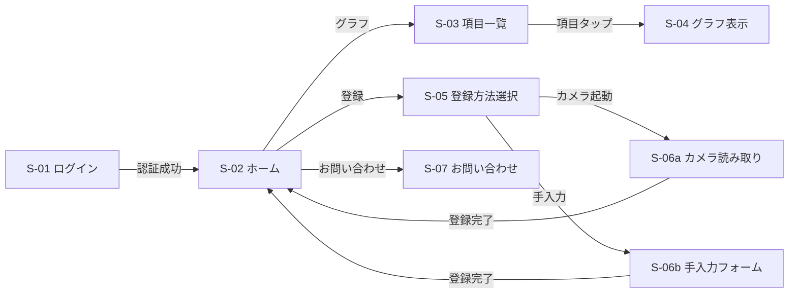

# 画面遷移・画面仕様刷新（S-01〜S-07）仕様

> **正本**: Obsidian `Dropbox/obsidian/task/specs/20260718-health-app-screen-flow.md`（v0.2）
> 本ファイルはリポジトリ内参照用の整形コピー。差異が生じた場合は正本を先に更新すること。
> 作成: 2026-07-18 / 対象: Android のみ（Web は現状維持）

## 概要

健康診断の検査結果を記録・可視化するアプリ。ログイン後、検査結果を「カメラ読み取り」または「手入力」で登録し、項目ごとの推移をグラフで閲覧できる。

## 画面一覧

| ID    | 画面名           | 役割 |
|-------|------------------|------|
| S-01  | ログイン         | Google SSO（Firebase Auth）で認証 |
| S-02  | ホーム           | 「登録」「グラフ」「お問い合わせ」への分岐 |
| S-03  | 項目一覧         | 検査項目のリスト表示・お気に入り管理 |
| S-04  | グラフ表示       | 選択した項目の推移グラフ |
| S-05  | 登録方法選択     | カメラ読み取り / 手入力 の二択 |
| S-06a | カメラ読み取り   | 撮影 → OCR候補の確認・補正 |
| S-06b | 手入力フォーム   | 項目ごとの数値入力 |
| S-07  | お問い合わせ     | サポート窓口（mailto でメール作成） |

## 画面遷移図

既存4画面（診断記録一覧・診断記録詳細・基準値外一覧・項目マスター管理）は廃止せず、S-02 のメニューから遷移する（決定 Q7）。

## 画面仕様（要点）

- **S-01**: Google SSO 維持（既存 uid 紐付け保持。決定 Q6）
- **S-02**: 3ボタン（登録→S-05 / グラフ📈→S-03 / お問い合わせ→S-07）+ オーバーフローメニュー（記録一覧・項目マスター・基準値外一覧・ログアウト）
- **S-03**: 全マスタ項目をカテゴリ（身体計測/血圧/血液一般/脂質/肝機能/腎機能/糖代謝/尿検査/その他）ごとに文字・枠色分け表示（色トークンは DESIGN.md）。♥お気に入り（ONは赤♥、上部固定・登録順=決定 Q2）。行タップ→S-04
- **S-04**: 折れ線グラフ。期間切替タブ **1年/全期間**（決定 Q3）+ 最新値表示。数値項目のみ対象
- **S-05**: 📷カメラで読み取る → S-06a / ✎手入力する → S-06b
- **S-06a**: 撮影→OCR（ML Kit v2 継続=決定 Q4）→ 候補一覧を確認画面で必ず補正可能に表示。⊕項目追加あり。「この内容で登録」→保存→S-02
- **S-06b**: マスタ順の入力欄+単位（カテゴリ色分け）。**BMI は身長・体重から自動計算+手動上書き可**（決定 Q8）。⊕項目追加。「登録する」→保存→S-02
- **S-07**: お名前/お問い合わせ内容 → 「送信」で **mailto Intent**（宛先 info@〜 は設定値。決定 Q9）

## 検査項目マスタ（決定 Q1: 法定健診レベルまで拡充）

詳細なシード定義は `data-model.md` を参照。性別依存項目は基準値なしでシードし、項目マスター管理画面で編集可能。

## スコープ外

- OCR精度チューニング / デザイン作り込み（後続タスク起票済み）
- Web 版の画面刷新（型定義の整合のみ実施）
